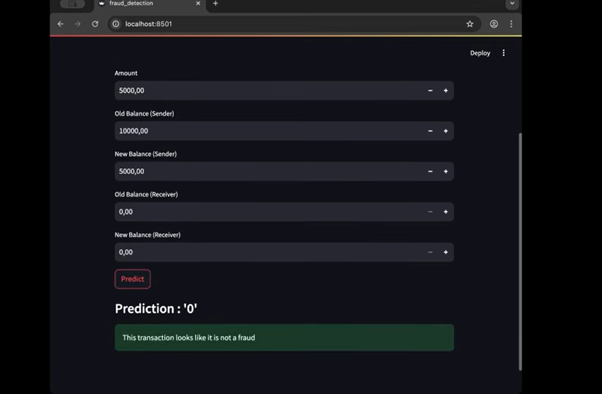

# Fraud Detection Prediction App

A Streamlit-based web application for predicting fraudulent financial transactions using a machine learning model. This project was developed as part of the FTL graduation capstone project.

## Features

- User-friendly web interface built with Streamlit
- Accepts transaction details as input
- Predicts whether a transaction is fraudulent using a trained machine learning model
- Instant feedback with clear results

## Demo



## Getting Started

### Prerequisites

- Python 3.7+
- pip

### Installation

1. **Clone the repository:**
   ```sh
   git clone https://github.com/abik1221/Ml_Froud-detection.git
   
   cd Ml_Froud-detection
   ```

2. **Install dependencies:**
   ```sh
   pip install -r requirements.txt
   ```
   *If `requirements.txt` is not present, install manually:*
   ```sh
   pip install streamlit pandas joblib
   ```

3. **Dawnload the model from kaggle dataset**
   ```sh
    https://www.kaggle.com/datasets/amanalisiddiqui/fraud-detection-dataset?resource=download
   ```
    
### unzip it and upload the .csv file in the rood folder of the project

4. **Ensure the model file is present:**
   - Place `fraud_detection_pipline.pkl` in the project directory.

### Running the App

```sh
streamlit run fraud_detection.py
```

The app will open in your default web browser.

## Usage

1. Enter the transaction details in the provided fields.
2. Click the **Predict** button.
3. The app will display whether the transaction is likely to be fraudulent.

## File Structure

```
├── AIML Dataset.csv            # Dataset used for training (optional)
├── analysis_model.ipynb        # Jupyter notebook for data analysis/modeling
├── fraud_detection.py          # Streamlit web app source code
├── fraud_detection_pipline.pkl # Trained machine learning model
├── LICENSE                     # MIT License
├── README.md                   # Project documentation
```

## License

This project is licensed under the MIT License. See the [`LICENSE`](LICENSE) file for details.

## Author

- **Nahom Keneni**

---

*For any questions or contributions, please open an issue or submit a pull request.*